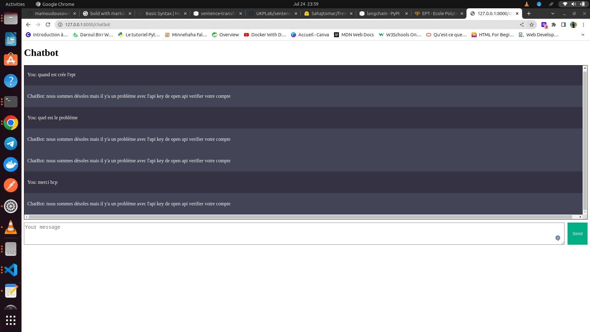
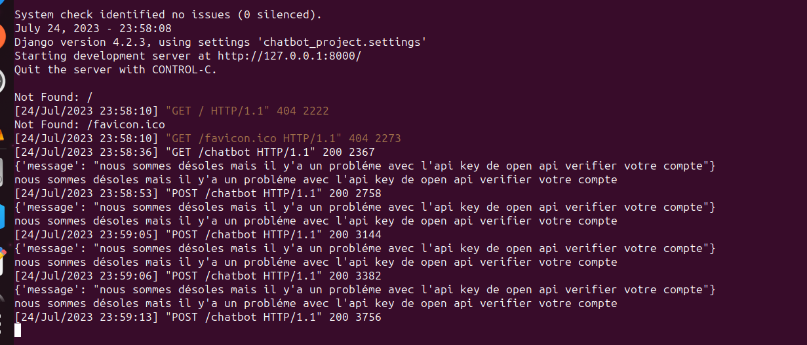

# chatbot using langchain with openai api

## Table of Contents
- [chatbot ](#sequencing_module)
  - [Table of Contents](#table-of-contents)
  - [General Info](#general-info)
    - [Screenshot](#screenshot)
  - [Technologies](#technologies)
  - [Installation](#installation)
    - [1. A little intro about the installation.](#1-a-little-intro-about-the-installation)
    - [2.Side information:](#2side-information)
  - [FAQs](#faqs)
    - [1. **general documentation**](#1-general-documentation)
    - [2. Contact the developers](#2-contact-the-developers)


## General Info
***
* this project is about creating a chatbot using word embeddings with the pretrained model host with the huggingface 

we use the french_semantic model for our embeddings
* after that we langchain linked with the openai api to process our embedding for 
the questions answers chain to provide a response after the process of our documents loaders

* the train the model using our specific information retrieved from the scrapping of the official of [ept](https://ept.sn/) 


### Screenshot
* screenshot 1


* screenshot 2



## Technologies
***
A list of technologies used within the project:
* [Django](https://www.djangoproject.com): Version 12.3
* [sentences-transformers](https://huggingface.co/Sahajtomar/french_semantic):  Version 2.2.2
* [lang chain ( llama_index )](https://python.langchain.com/): Version 0.0.240


## Installation
***

### 1. A little intro about the installation.

list of requirements needed before cloning the project
we need docker and docker-compose installed on your machine

* docker and docker-compose additional information on the official [site](https://www.docker.com/) 
* python installed
* pip3 installed

```
$ git clone https://github.com/mamoudousow098/projet_thecno_ml_dl.git
$ cd ../path/to/the/file
$ docker-compose up -d
```
### 2.Side information: 
To use the application in a special environment use 
```
after cloning the project and change the directory to the root directory of the project, you can create a  virtual environmment in python with these commands:
$ python -m venv nameOftheVitualEnv
if your plaftorm is windows , you can activate your virtual environment already created by the following command
$ path-to-the-virtual-env-directory\Scripts\activate.bat

Otherwise, if your plaftorm is UNix system, you can activate your virtual envrionment by these commands:
$source path-to-the-virtual-env-directory/bin/activate

after creating and activating your virtual environment, you can start the project by executing the steps in the introduction of the installation

to test the app we have the use the **Base URL** adding with **/chatbot** to use our user interface to interact with our chatbot

``` 


## FAQs
***
A list of frequently asked questions
### 1. **general documentation**
you can debug or mastering any project with the offical website of the django and the django rest framework
* [Django](https://www.djangoproject.com)
* [flask](https://flask.palletsprojects.com/en/2.3.x/)
  
list of faqs you might need to consult
* [deploy app with django](https://vahiwe.medium.com/deploy-django-and-flask-applications-in-the-cloud-using-nginx-gunicorn-and-systemd-centos-7-4b6aef3a8578)
* [deploy django application](https://dev.to/sayam753/deploy-django-4k0d)

### 2. Contact the developers
For further information you can directly contact the two developers of the project
* [Mamoudou Mamadou Sow](<MAILTO:smamadoumamoudou@ept.sn>)
* [Mamoudou amar abdoulaye Diallo](<MAILTO:dmamadouamar@ept.sn>)
* [Aissatou Balde](<MAILTO:baldeaissatou@ept.sn>)

